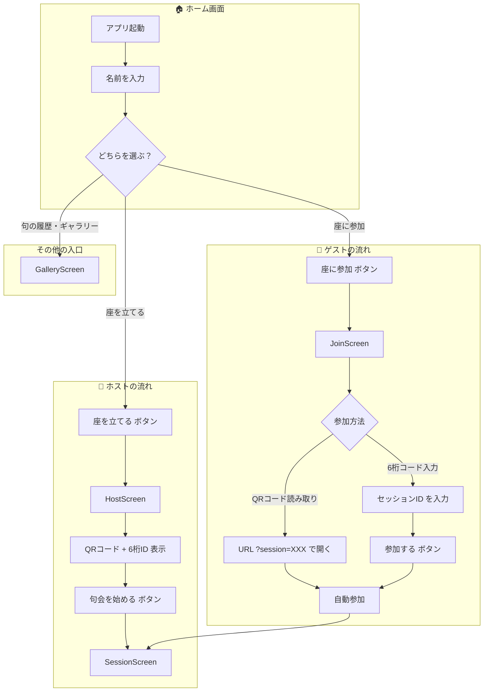
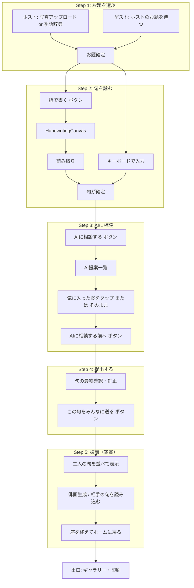
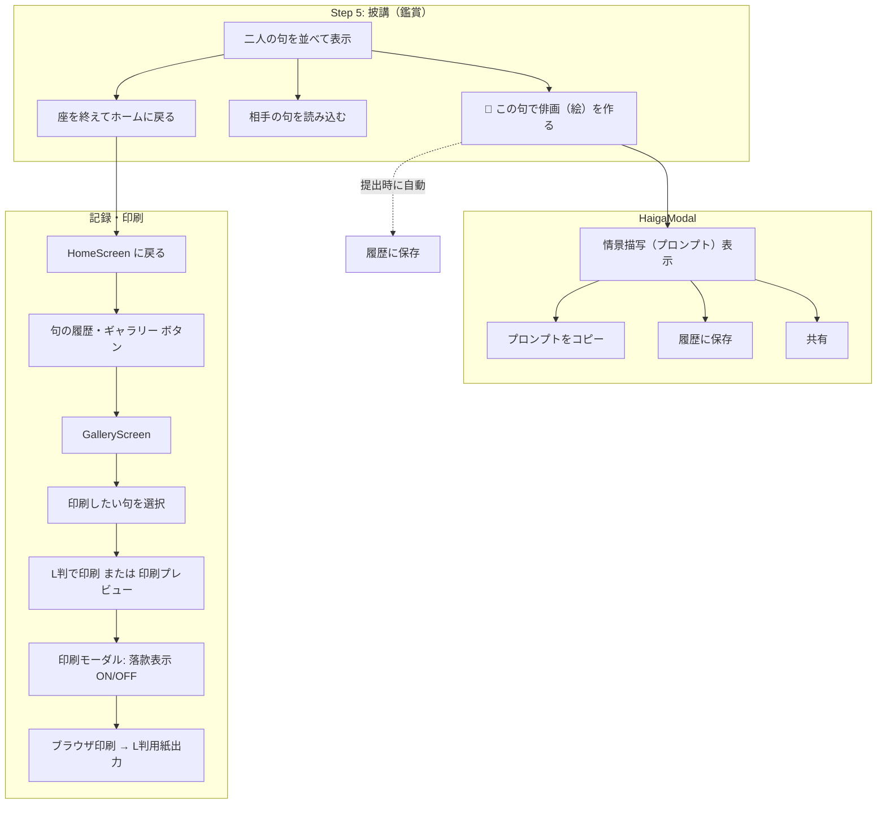

# 操作フロー仕様書 — AI句会ワークショップ（ペアモード）

Figma Make 用の操作フロー仕様書です。入口（起動・座の開始）から出口（印刷・保存）までの全行程を、ホストとゲストそれぞれの視点で整理しています。

---

## パートA：入口の分岐（セットアップ）

### A1. Mermaid フローチャート



### A2. ホストの流れ（詳細）

| 順序 | 画面 | 役割 | 主要なボタン・アクション |
|------|------|------|--------------------------|
| 1 | **HomeScreen** | 名前入力と入口選択 | 入力: あなたの名前（芭蕉、蕪村など）<br>ボタン: 「座を立てる」「座に参加」「📚 句の履歴・ギャラリー」 |
| 2 | **HostScreen** | 参加者を待つ、QR・ID 共有 | 表示: 6桁セッションID（例: `ABC123`）、QRコード<br>ボタン: 「句会を始める」「キャンセル」 |

**操作手順（ホスト）**  
1. 名前を入力する  
2. 「座を立てる」をタップする  
3. HostScreen で 6桁ID または QRコードを相手に示す  
4. 相手が参加したら「句会を始める」をタップする  

### A3. ゲストの流れ（詳細）

| 順序 | 画面 | 役割 | 主要なボタン・アクション |
|------|------|------|--------------------------|
| 1 | **HomeScreen** | 名前入力と入口選択 | 入力: あなたの名前<br>ボタン: 「座に参加」 |
| 2 | **JoinScreen** | セッション参加 | 入力: セッションID（6桁）<br>ボタン: 「参加する」「戻る」 |
| 2' | **（QR経由）** | URL で自動参加 | ホストの QR を読み取り → `?session=ABC123` 付き URL が開く → 自動で joinSession |

**操作手順（ゲスト）**  
**パターンA: QRコード**  
1. 名前を入力する  
2. 「座に参加」をタップする  
3. JoinScreen を開いたまま、別端末でホストの QR を読み取る  
4. アプリが `?session=XXX` 付きで開き、自動参加する  

**パターンB: 6桁コード**  
1. 名前を入力する  
2. 「座に参加」をタップする  
3. ホストから聞いた 6桁コードを入力する  
4. 「参加する」をタップする  

### A4. ホストとゲストの画面差分（入口）

| 項目 | ホスト | ゲスト |
|------|--------|--------|
| 参加画面 | HostScreen（QR表示・ID表示） | JoinScreen（ID入力）または URL 自動参加 |
| カメラ | 不要（QRを表示するだけ） | QR読み取り時は端末のカメラでQRをスキャン |
| 待機 | 相手の参加を待ってから「句会を始める」 | 参加後すぐ SessionScreen へ |

---

## パートB：共通のウィザード（俳句作成）

### B1. Mermaid フローチャート



### B2. 各ステップの画面役割と主要アクション

#### Step 1: お題を選ぶ

| 役割 | ホスト | ゲスト |
|------|--------|--------|
| **画面** | 写真アップロード or 季語辞典 | 「ホストがお題を探しています…」待機 |
| **注目する場所** | 季語リスト、写真、季語辞典 | お題（季語）の表示 |
| **操作** | 写真選択 → 季語を1つタップ → Step 2 へ<br>または「季語辞典から選ぶ」→ 季語選択 → 「この季語をお題にする」 | お題が出たら「次へ」をタップ |
| **同期** | ホストがお題を選ぶと sessions が更新され、ゲストは同じお題を見る |

#### Step 2: 句を詠む

| 役割 | ホスト・ゲスト共通 |
|------|-------------------|
| **画面** | テキスト入力欄 + 「✍️ 指で書く（デジタル半紙）」ボタン |
| **注目する場所** | 入力欄、または三本線の白い画面（HandwritingCanvas） |
| **操作** | キーボード入力 **または** 「指で書く」タップ → 線の間に五・七・五を書く → 「これで決める（完了）」→ 読み取り後 Step 3 へ |
| **同期** | 各ユーザーが自分の句のみ編集。activeStep はユーザーごとに独立進行 |

#### Step 3: AIに相談

| 役割 | ホスト・ゲスト共通 |
|------|-------------------|
| **画面** | 現在の句 + AI提案アコーディオン + 「AIに相談する」ボタン |
| **注目する場所** | 編集可能な句エリア、AI提案一覧 |
| **操作** | 「AIに相談する」→ 提案から気に入ったものをタップして反映<br>「AIに相談する前へ」で Step 4 へ |
| **同期** | 各ユーザーが自分の句のみ相談・反映 |

#### Step 4: 提出する

| 役割 | ホスト・ゲスト共通 |
|------|-------------------|
| **画面** | 最終確認用テキストエリア（訂正可能）+ 「この句をみんなに送る」 |
| **注目する場所** | 句の表示エリア、送信ボタン |
| **操作** | 必要なら句を訂正 → 「この句をみんなに送る」をタップ |
| **同期** | 送信で haikus テーブルに保存。相手は Realtime で受信（Step 5 で表示） |

#### Step 5: 披講（鑑賞）

| 役割 | ホスト・ゲスト共通 |
|------|-------------------|
| **画面** | 二人の句を並べて表示、「この句で俳画（絵）を作る」「相手の句を読み込む」「座を終えてホームに戻る」 |
| **注目する場所** | 自分の句・相手の句エリア、俳画ボタン |
| **操作** | 俳画生成 → HaigaModal で情景確認・コピー・履歴保存<br>「相手の句を読み込む」で相手の句を表示<br>「座を終えてホームに戻る」で HomeScreen へ |
| **同期** | 相手の句は Realtime または「相手の句を読み込む」で取得 |

### B3. ホストとゲストの画面差分（ウィザード内）

| 項目 | ホスト | ゲスト |
|------|--------|--------|
| Step 1 | 写真アップロード、季語選択、季語辞典 | 待機画面 → お題表示 → 次へ |
| Step 2〜5 | 同一レイアウト | 同一レイアウト |
| 共有写真 | ホストがアップロードした写真を Step 2〜4 で表示 | 同上（sessions.shared_image で共有） |

---

## パートC：出口（披講と記録）

### C1. Mermaid フローチャート



### C2. 披講から記録までの画面役割

| 順序 | 画面・モーダル | 役割 | 主要なボタン・アクション |
|------|----------------|------|--------------------------|
| 1 | **SessionScreen Step 5** | 二人の句を並べて鑑賞 | 「🎨 この句で俳画（絵）を作る」「相手の句を読み込む」「座を終えてホームに戻る」 |
| 2 | **HaigaModal** | 俳画の情景描写・保存・共有 | 「プロンプトをコピー」「履歴に保存」「📤 共有」 |
| 3 | **HomeScreen** | 出口への入口 | 「📚 句の履歴・ギャラリー」 |
| 4 | **GalleryScreen** | 履歴一覧、印刷 | リスト/カード切替、句選択、「🖨️ L判で印刷」「印刷プレビュー」 |
| 5 | **印刷モーダル** | L判プレビュー、落款表示 | 「落款を表示」チェック、「🖨️ 印刷する」→ ブラウザ印刷ダイアログ |

### C3. 出口フローの操作手順

1. **披講で鑑賞**  
   Step 5 で二人の句を確認し、必要なら「相手の句を読み込む」で相手の句を表示する。

2. **俳画・履歴保存（任意）**  
   「この句で俳画（絵）を作る」→ HaigaModal で情景を確認し、「履歴に保存」をタップする。

3. **ホームへ戻る**  
   「座を終えてホームに戻る」で HomeScreen に戻る。

4. **ギャラリーから印刷**  
   「句の履歴・ギャラリー」→ 印刷したい句を選ぶ → 「L判で印刷」または「印刷プレビュー」→ 落款表示の有無を選び → 「印刷する」→ ブラウザの印刷で L判用紙に出力する。

### C4. ホストとゲストの画面差分（出口）

| 項目 | ホスト | ゲスト |
|------|--------|--------|
| 披講 | 同一 | 同一 |
| 俳画生成 | 自分の句で生成可能 | 自分の句で生成可能 |
| 履歴 | 自分の句は提出時に自動保存 | 同上 |
| 印刷 | ギャラリーから同じ手順で印刷 | 同上 |

---

## 付録：画面一覧とモード遷移

```mermaid
stateDiagram-v2
    [*] --> HomeScreen
    HomeScreen --> HostScreen: 座を立てる
    HomeScreen --> JoinScreen: 座に参加
    HomeScreen --> GalleryScreen: 句の履歴・ギャラリー

    HostScreen --> SessionScreen: 句会を始める
    HostScreen --> HomeScreen: キャンセル

    JoinScreen --> SessionScreen: 参加する
    JoinScreen --> HomeScreen: 戻る

    SessionScreen --> HomeScreen: 座を終えてホームに戻る

    GalleryScreen --> HomeScreen: 閉じる/戻る

    note right of SessionScreen
        activeStep: 1→2→3→4→5
        role: host / guest
    end
```
