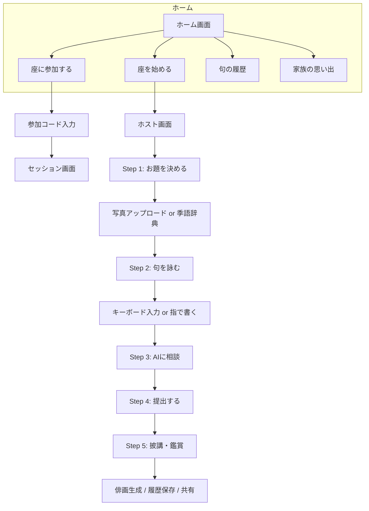
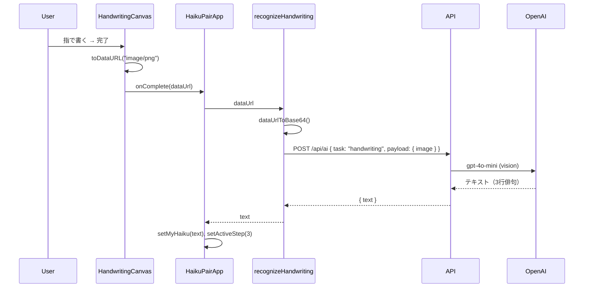

# 技術的設計書 - AI句会ワークショップ（ペアモード）

## 1. システム概要

### 1.1 アプリの目的

本アプリは**俳句を通じたリハビリ・コミュニケーション支援**を目的とした Web アプリケーションです。

- **対象ユーザー**: シニア世代（お父様・お母様）とその補助者（家族・介護者）
- **主な価値**:
  - 写真から季語を選び、俳句を詠むことで認知機能の維持・活性化を支援
  - 指書き（デジタル半紙）による手のリハビリ
  - 二人一組の「座」で同じお題を詠み、披講（鑑賞）を通じたコミュニケーション促進
  - AI による季語提案・句の相談・俳画（情景描写）生成

### 1.2 主要な UX フロー



| Step | 内容 |
|------|------|
| 1 | 写真から季語を選ぶ、または季語辞典からお題を決定 |
| 2 | 俳句を詠む（キーボード入力 or デジタル半紙で指書き） |
| 3 | AI に相談して言い換え案を取得 |
| 4 | 訂正可能な状態で最終確認し、みんなに送信 |
| 5 | 披講（二人の句を並べて鑑賞）、俳画生成、履歴保存 |

---

## 2. 技術スタック

### 2.1 フロントエンド

| 技術 | 用途 |
|------|------|
| **Next.js 16** | App Router、SSR、API Routes |
| **React 19** | UI コンポーネント |
| **Tailwind CSS 4** | スタイリング、レスポンシブ |
| **Kaisei Opti** | 俳句・ポラロイド用明朝体 |

### 2.2 バックエンド / データベース

| 技術 | 用途 |
|------|------|
| **Supabase** | 認証基盤、PostgreSQL、Realtime、Storage |
| **Supabase Storage** | 俳句に紐づく写真の保存（`haiku-images` バケット） |

### 2.3 AI 連携

| 技術 | 用途 |
|------|------|
| **OpenAI API (gpt-4o-mini)** | 写真解析、手書き OCR、俳句提案、俳画情景描写 |

※ 現状は OpenAI のみ。Google Gemini 等への切り替えは `app/api/ai/route.ts` の `callProvider` を差し替えることで対応可能。

### 2.4 主要ライブラリ

| ライブラリ | 用途 |
|------------|------|
| **react-signature-canvas** | デジタル半紙（指書きキャンバス） |
| **qrcode** | 参加用 QR コード生成 |
| **@supabase/supabase-js** | Supabase クライアント |

---

## 3. 主要機能の技術仕様

### 3.1 指書きキャンバス（デジタル半紙）

**担当ファイル**: `components/HandwritingCanvas.tsx`

#### 低スペック端末向けの軽量化設定

- **react-signature-canvas** のパラメータ:
  - `throttle={16}`: 約 60fps に制限し、描画イベントの過剰発火を抑制
  - `velocityFilterWeight={0.7}`: 筆致の滑らかさとレスポンスのバランス
  - `minWidth={4}`, `maxWidth={9}`: 線の太さを制限し、描画負荷を軽減

#### 筆致（ベロシティ）の調整

```tsx
// HandwritingCanvas.tsx
<SignatureCanvas
  velocityFilterWeight={0.7}  // 0〜1。高いほど滑らか、低いほど素早く反応
  minWidth={4}
  maxWidth={9}
  penColor="black"
  throttle={16}
  clearOnResize={false}
/>
```

- `velocityFilterWeight`: 描画速度に応じた線の太さ変化。0.7 でシニア向けにやや滑らかめに調整。

#### レイアウト・アクセシビリティ

- `100dvh` / `100svh` でモバイルのアドレスバー変動に対応
- `touchAction: "none"` でスクロールと描画の競合を防止
- 縦長タブレット向けに 3:4 アスペクト比を想定（`?handwritingDebug=1` で確認可能）

---

### 3.2 OCR パイプライン（手書き → テキスト）

**フロー**:



**担当ファイル**:

| ファイル | 役割 |
|----------|------|
| `lib/ai/recognizeHandwriting.ts` | data URL → Base64 変換、`callAI` 呼び出し |
| `lib/ai/client.ts` | `POST /api/ai` へのリクエスト送信 |
| `app/api/ai/route.ts` | `handwriting` タスクのプロンプト構築、OpenAI 呼び出し |

**プロンプト要点**:
- 横書き 3 行の俳句（5・7・5）を正確に読み取る
- 改行・句読点を維持
- 読み取れない文字は `?` で代替

---

### 3.3 ポラロイド UI とオーバーレイ（指書き画像）

**担当ファイル**: `components/PolaroidCard.tsx`, `app/globals.css`

#### 構成

- **上部**: 写真エリア（正方形、`aspect-ratio: 1`）
- **下部**: キャプション（俳句テキスト、日付、**落款としての指書き画像**）

#### mix-blend-mode を用いた合成

指書き画像は**キャプション領域内**に落款（サイン）風に配置され、`mix-blend-mode: multiply` で背景と合成されます。

```css
/* app/globals.css */
.polaroid-card__handwriting {
  position: absolute;
  bottom: 8px;
  right: 8px;
  width: 25%;
  height: 25%;
  max-width: 60px;
  max-height: 60px;
  mix-blend-mode: multiply;
  opacity: 0.9;
  transform: rotate(-5deg);
}
```

- 写真の上に直接オーバーレイするのではなく、**キャプション（俳句・日付の下）**に小さく配置
- `mix-blend-mode: multiply` により、白背景ではほぼ見えず、色付き背景では自然に溶け込む

---

### 3.4 Epson L 判印刷システム

**担当ファイル**: `app/globals.css`, `components/screens/GalleryScreen.tsx`

#### 用紙サイズ

- **89mm × 127mm**（Epson EP シリーズ等の L 判）

#### @media print と @page

```css
@media print {
  @page {
    size: 89mm 127mm;
    margin: 0;
  }

  body > *:not(.polaroid-print-root) {
    display: none !important;
  }

  .polaroid-print-root {
    display: flex !important;
    align-items: center;
    justify-content: center;
    position: fixed !important;
    inset: 0 !important;
    background: white !important;
  }

  .polaroid-print-root .polaroid-card {
    color-adjust: exact;
    print-color-adjust: exact;
  }
}
```

#### 印刷フロー

1. ギャラリーで句を選択し「印刷」ボタンをクリック
2. `polaroid-print-root` 内に `PolaroidCard` をレンダリング
3. ブラウザの印刷ダイアログで用紙を L 判に設定
4. `@page` により 89×127mm に最適化されたレイアウトで出力

#### 落款（指書き）の表示オプション

- 印刷プレビューで「落款を表示」を ON にすると、`handwriting_image_url` がキャプション内に表示される

---

## 4. データ構造（Schema）

### 4.1 HaikuHistoryEntry

**定義**: `lib/types.ts`

```typescript
export interface HaikuHistoryEntry {
  id: number | string;
  haiku: string;
  kigo: string;
  season: string;
  author: string;
  date: string;
  image_url?: string | null;        // 俳句に紐づく写真（Cloudinary / Supabase URL）
  handwriting_image_url?: string | null;  // 指書き画像（Base64 data URL）
  tags?: string[] | null;           // AI 生成タグ
}
```

### 4.2 手書き画像データの保存と連携

| 保存先 | 用途 |
|--------|------|
| **localStorage** | 提出直後の `saveToHistory` で `handwriting_image_url` を Base64 で保存。Supabase の `haikus` には画像 URL を保存しない設計のため、履歴表示時に localStorage とマージ |
| **Supabase haikus** | `image_url` のみ（共有写真）。`handwriting_image_url` は未保存 |
| **GalleryScreen** | `mergeHandwritingFromLocal` で Supabase 履歴と localStorage 履歴を照合（haiku + 日付）し、`handwriting_image_url` をマージして表示 |

```typescript
// lib/storage.ts - saveHistory / loadHistory で localStorage に保存
// components/screens/GalleryScreen.tsx - mergeHandwritingFromLocal でマージ
```

### 4.3 Supabase テーブル（想定）

| テーブル | 主なカラム |
|----------|-------------|
| `sessions` | id, code, kigo, season, shared_image, shared_hints |
| `participants` | id, session_id, name, role, client_key, user_id |
| `haikus` | id, session_id, participant_id, user_id, content, image_url, submitted_at |
| `profiles` | id, display_name |
| `ai_request_logs` | id, user_id, request_type, created_at |
| `family_haikus` | id, haiku_text, image_url, tags, origin_date |

---

## 5. 環境構築・デプロイ

### 5.1 必要な環境変数

| 変数名 | 説明 | 必須 |
|--------|------|------|
| `NEXT_PUBLIC_SUPABASE_URL` | Supabase プロジェクト URL | ○ |
| `NEXT_PUBLIC_SUPABASE_ANON_KEY` | Supabase 匿名キー | ○ |
| `OPENAI_API_KEY` | OpenAI API キー（写真解析・OCR・俳句提案・俳画） | ○ |

`.env.local` に設定:

```env
NEXT_PUBLIC_SUPABASE_URL=https://xxxx.supabase.co
NEXT_PUBLIC_SUPABASE_ANON_KEY=eyJ...
OPENAI_API_KEY=sk-...
```

### 5.2 ビルド・実行手順

```bash
# 依存関係インストール
npm install

# 開発サーバー起動
npm run dev

# 本番ビルド
npm run build

# 本番サーバー起動
npm start
```

### 5.3 Supabase セットアップ

1. プロジェクト作成
2. Storage バケット `haiku-images` を作成（公開読み取り可）
3. テーブル作成: `sessions`, `participants`, `haikus`, `profiles`, `ai_request_logs`, `family_haikus`
4. RLS ポリシーを設定（必要に応じて）

---

## 付録: ディレクトリ構成

```
haiku-pair-app/
├── app/
│   ├── api/ai/route.ts      # AI タスクのルートハンドラ
│   ├── globals.css          # グローバルスタイル、ポラロイド、印刷
│   ├── layout.tsx
│   └── page.tsx
├── components/
│   ├── HaikuPairApp.tsx     # メインアプリ（状態管理・画面切り替え）
│   ├── HandwritingCanvas.tsx # デジタル半紙
│   ├── PolaroidCard.tsx     # ポラロイド風カード（印刷用）
│   ├── FamilyGallery.tsx    # 家族の思い出ギャラリー
│   ├── modals/              # HaigaModal, AISuggestModal, ShareCardModal
│   ├── screens/             # HomeScreen, HostScreen, JoinScreen, SessionScreen, GalleryScreen, KigoDictScreen
│   └── shared/              # MoraCounter
├── lib/
│   ├── ai/                  # analyzeImage, recognizeHandwriting, generateHaiku, generateHaiga, client
│   ├── supabase/            # client, storage, aiRateLimit
│   ├── cloudinary.ts        # 画像 URL 最適化
│   ├── haikuHistoryApi.ts   # Supabase から履歴取得
│   ├── familyHaikusApi.ts   # 家族の句取得
│   ├── kigo.ts              # 季語辞典
│   ├── mora.ts              # 音数カウント
│   ├── storage.ts           # localStorage（セッション、履歴、ユーザーID）
│   └── types.ts             # 型定義
└── docs/
    └── technical_design.md  # 本ドキュメント
```
